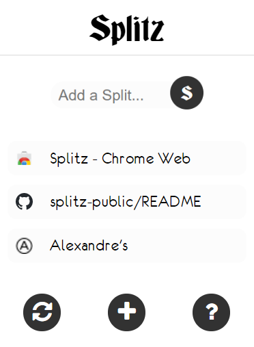

# Splitz

Splitz is an exclusive Chrome Extension to help users manage their tabs efficiently.

## Installation

Use the following URL to install Splitz from the official Chrome Store:


[https://chrome.google.com/webstore/detail/splitz/kbepjlbbljaidojicmmjafnolfipokmf](https://chrome.google.com/webstore/detail/splitz/kbepjlbbljaidojicmmjafnolfipokmf)

## How to Use It



```bash
1. Click on the Logo 'Splitz' to alternate between two different color schemes (Light and Dark)
2. Hover the mouse over the 'S' symbol to open the text box and enter the name of the Splitz you want to add
   (Note: Empty values are not allowed)
3. Once you have the name of the Splitz written, click on the 'S' button to add it to your Workspace
4. Position tabs the way you want by dragging them to the desired spot.
5. Close a tab/Splitz by pressing on the 'X' symbol
6. Click on the '+' button to add a new tab in your Chrome window
7. Display the Refresh and Help buttons by hovering the mouse over this area
8. Click on the Refresh Button to clear all your Splitz and start over
9. Click on the Help Button to open this URL and learn more about Splitz

```

## Feedback
We welcome any feedback from our users to improve our services. Please complete the following Google Form to let us know how we can improve:

[https://forms.gle/Kt9L3FcJWpY69Fzn8](https://forms.gle/Kt9L3FcJWpY69Fzn8)

## Contributing
Thank you for downloading Splitz and helping us improve the extension to better suit your needs. Please consider supporting the team on Patreon for more ideas and projects:

```bash
https://www.patreon.com/
```
